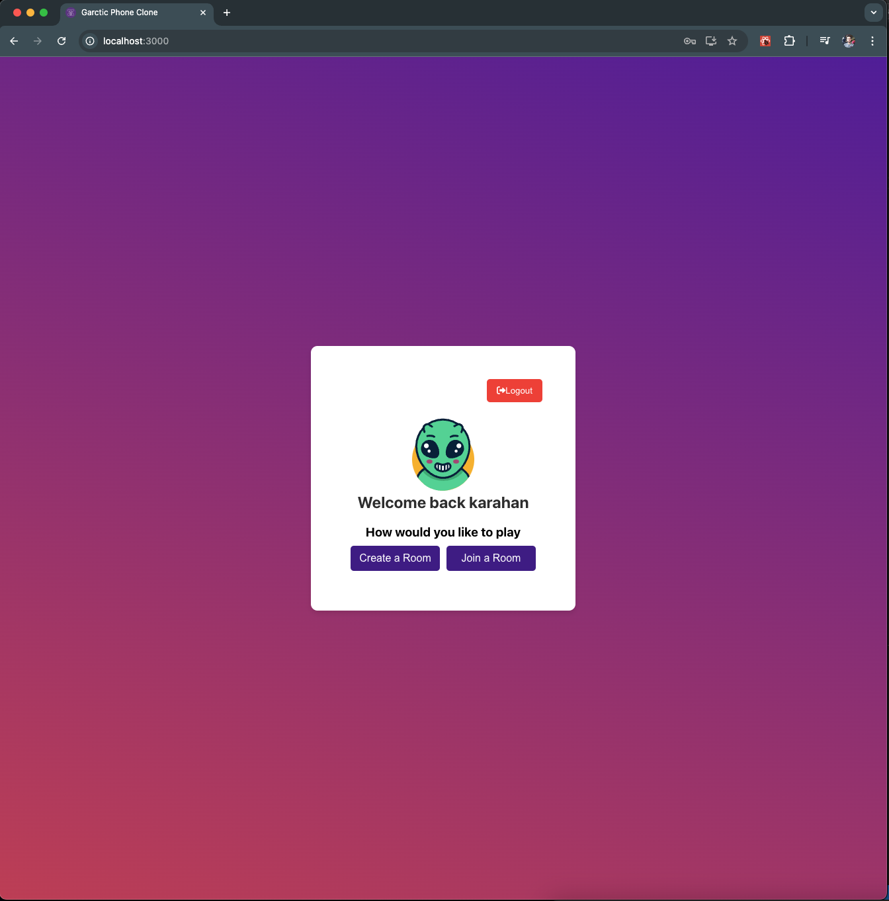
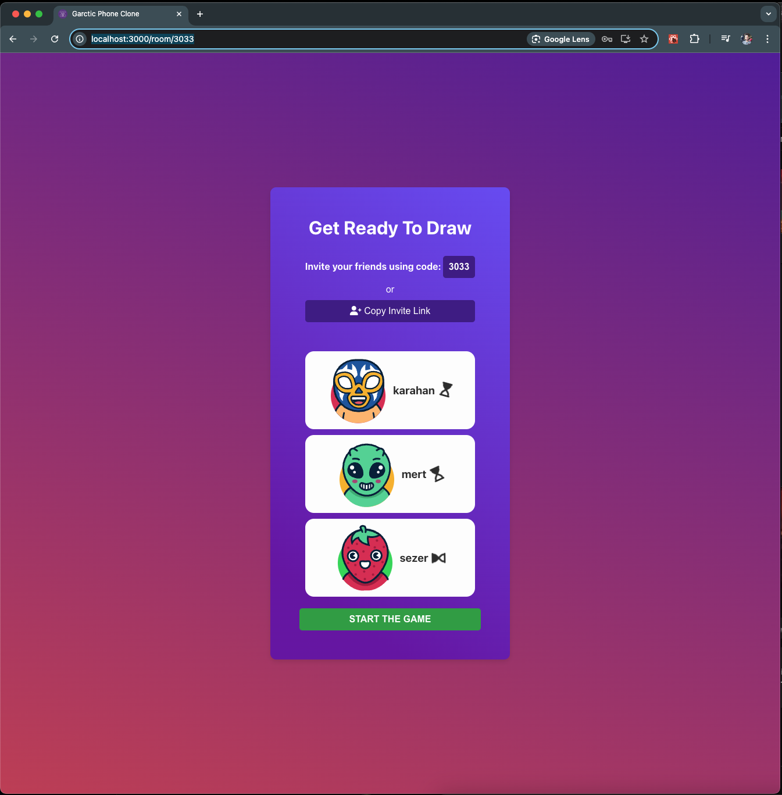
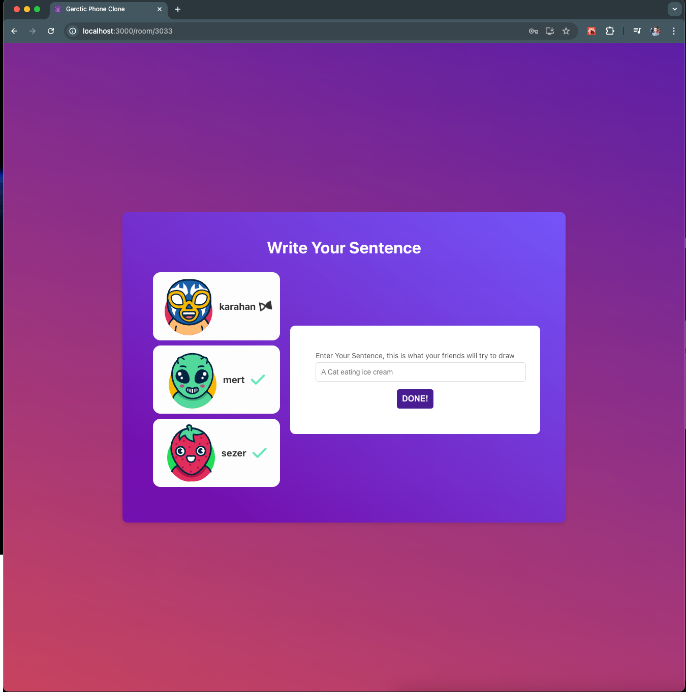
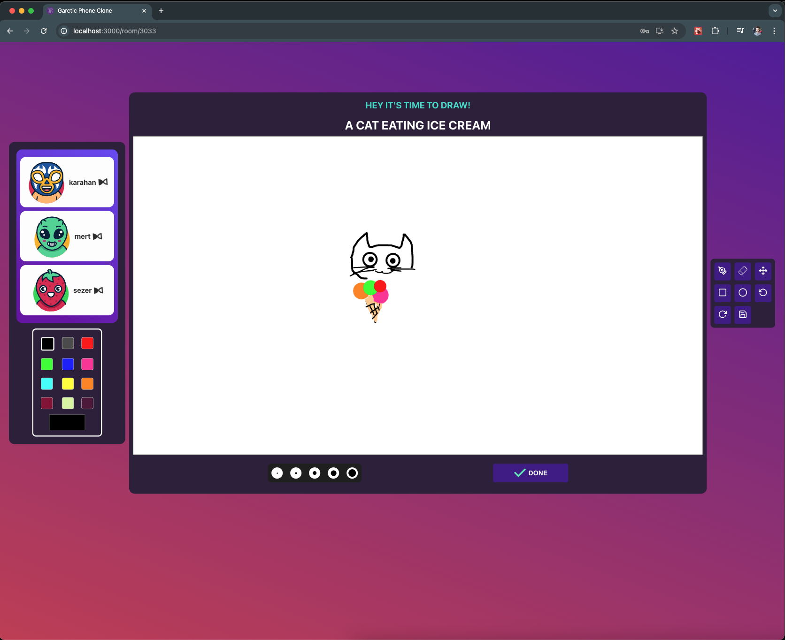

# Garctic Phone Clone - Server

This project is the server side of my Garctic Phone clone, developed with Node.js and Typescript

## About the project

This game features a robust architecture, utilizing a Typescript Node.js for the backend and React.js for the frontend. It uses MongoDB for data management and Socket.io for real-time communication

## How to play

1. Login to your account
   

2. Create a lobby and invite your friends
   

3. Enter your initial sentences, they will shared randomly to each player to draw
   

4. Start drawing and repeat the cycle
   

## Getting started

Make sure typescript and Node is installed
In the project directory, you can run
install npm packages

### `npm install`

build typescript project

### `npm run build`

start the project

### `npm run start`

Note: The frontend for the application can also be found in my repositories: https://github.com/karahanozen98/garctic-phone-clone-server
